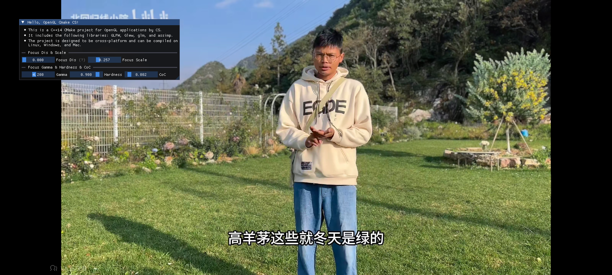

Bokeh Depth ByCS
=======================

This is a C++17 CMake OpenGL project for AI Bokeh applications use NCNN & MNN by CS. It includes the following libraries: **GLFW**, **Glew**, and **glm**. It also uses **ImGui** for GUI. The project is compiled on  ***Windows***.

About Blog: [https://blog.csdn.net/sCs12321/article/details/143893389](https://blog.csdn.net/sCs12321/article/details/143893389)

download Libs and models: [Google drive](https://drive.google.com/drive/folders/17PkFm9KEKEuEet_dPRXbAMS8LuLqNV0C?usp=sharing), put them into `lib` `model` directory.

**Features**:

- Ready-to-use C++17 CMake project for OpenGL applications
- Uses **GLFW**, **Glew**, **glm** , **OpenCV**, **glm**, **Eigen**, **VulkanSDK**, **ncnn**, **mnn**, **protobuf** libraries
- Uses ImGui for GUI
- Supports Windows, but libraries for Linux, Mac are not included
- Includes a Shader class and an example Application

**Functionality**:

- Creates a simple OpenGL application with a window
- Loads and displays 3D models using assimp
- Load 3DLUT texture and render pseudo-color of image exposure
- Render zebra patterns of image exposure
- Render image waveform

**Requirements**:
- C++17 Compiler (GCC 4.8+, Clang 3.4+, MSVC 2015+)
- CMake 3.8+

<div style="display:flex;">
    
    
</div>

### Building with Visual Studio

1. Open Visual Studio.
2. Select "Open Folder" and then choose the project directory.
3. Configure the build options (e.g., bokeh-depthv2-ncnn-mnn-opengl-opencv-ByCS.exe).
4. Build the target.

### Custom Modules

Custom modules are located in the `my_src` directory and include the following submodules:

- `kalman`: Code related to Kalman filtering
- `ncnn_model`: Inference code related to ncnn and mnn models
- `render`: Code related to rendering

### Configuration File
- `config.ini`: Configuration file for the project

### Running the Main Program

After compilation, you can find the generated executable file in the [`out`] directory. Run the main program:

```sh
./main.exe
```

### Adding New Modules

1. Create a new subdirectory in the `my_src` directory.
2. Add source files and header files in the new subdirectory.
3. Modify the corresponding `CMakeLists.txt` file to add the compilation configuration for the new module.

Feel free to contribute and provide any comments or suggestions.
